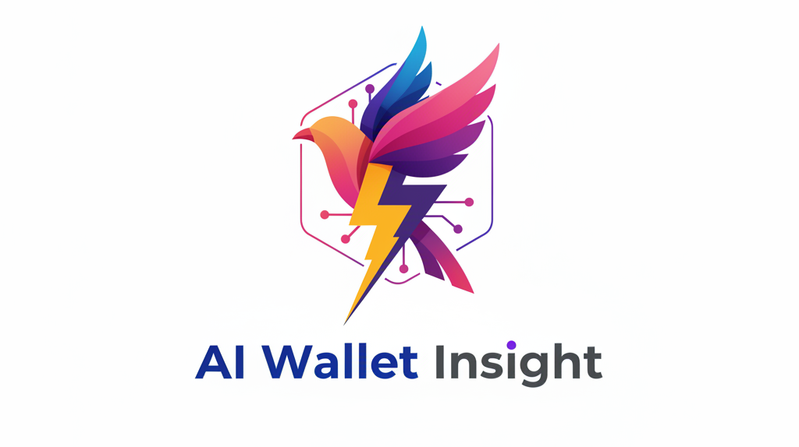

# AI Wallet Insight

**Revolutionary AI-powered Stacks blockchain analytics with conversational intelligence**

Built for the **Stacks Vibe Coding Hackathon** - A groundbreaking application that transforms complex blockchain data into natural conversations, making the Bitcoin economy accessible to everyone through advanced AI agents.

   

## Project Overview

AI Wallet Insights represents the future of blockchain analytics - where complex transaction data becomes as easy to understand as having a conversation. Instead of struggling with raw blockchain explorers or writing complex queries, users can simply ask questions in natural language and receive intelligent, contextual answers.

### Why We Built This

The Bitcoin and Stacks ecosystems contain billions of dollars in transactions, but understanding wallet behavior remains a technical challenge. Current blockchain explorers show raw data without context, making it difficult for users to:

- Understand their own transaction patterns
- Analyze wallet behavior and trends  
- Extract meaningful insights from transaction history
- Make informed decisions based on blockchain data

We built AI Wallet Insights to democratize blockchain analytics, making Stacks data accessible to everyone from crypto newcomers to DeFi power users, directly supporting the core mission of Stacks: unlocking the Bitcoin economy.

## Revolutionary Features

**Three-Tier AI Agent System** - Our breakthrough architecture handles any complexity of blockchain analysis through intelligent agent orchestration

**Conversational Analytics** - Transform complex blockchain queries into natural language conversations

**Real-time Intelligence** - Instant analysis of wallet balances, transaction patterns, and behavioral insights

**Advanced Agent Modes** - Specialized AI agents for different types of analysis, from simple queries to complex data processing

**Background Data Processing** - Intelligent preloading and caching for lightning-fast responses

**Self-Correcting AI** - Advanced error recovery and code generation with recursive improvement

## How It Works

AI Wallet Insights operates through a sophisticated three-tier AI agent system that intelligently routes queries based on complexity and data requirements:

### 1. Regular Mode
For simple, direct questions that can be answered with currently loaded data:
- "What's my current balance?"
- "How many transactions do I have?"
- "What was my last transaction?"

The AI responds instantly using the wallet's basic transaction data (typically the 20 most recent transactions).

### 2. Agent Mode  
For specific queries requiring targeted data fetching:
- "Show me transaction number 500"
- "What happened on a specific date?"
- "Get details about a particular transaction"

Agent Mode uses our intelligent protocol to fetch specific data from the Stacks API and provide precise answers.

### 3. Pro Agent Mode
For complex analysis requiring processing of entire transaction histories:
- "Which address received the most STX from me?"
- "List all unique recipients"
- "Analyze my transaction patterns over time"

Pro Agent Mode processes thousands of transactions with custom JavaScript code execution, providing comprehensive analysis impossible with traditional blockchain explorers.

## The Agent Protocol

At the heart of our system is an innovative JSON-based protocol that enables AI to dynamically control data fetching and processing:

```json
{
  "action": "use_agent",
  "uri": "https://api.testnet.hiro.so/extended/v1/address/ADDRESS/transactions",
  "uri_data": null,
  "recursive": true,
  "code": "JavaScript code for data processing"
}
```

### Protocol Components

**action**: Always "use_agent" to trigger the agent system
**uri**: The full API endpoint URL to fetch data from
**uri_data**: Optional JSON data to send with POST requests
**recursive**: Boolean flag for advanced processing modes
**code**: Custom JavaScript code for Pro Agent Mode analysis

### Agent Mode Variations

**Regular Agent Mode**:
```json
{
  "action": "use_agent",
  "uri": "https://api.testnet.hiro.so/extended/v1/address/ADDRESS/transactions?limit=1&offset=500",
  "uri_data": null
}
```

**Flash Agent Mode** (with regex search):
```json
{
  "action": "use_agent", 
  "uri": "https://api.testnet.hiro.so/extended/v1/address/ADDRESS/transactions",
  "uri_data": null,
  "recursive": true,
  "regex": "/\\bSPECIFIC_ADDRESS\\b/"
}
```

**Pro Agent Mode** (with code execution):
```json
{
  "action": "use_agent",
  "uri": "https://api.testnet.hiro.so/extended/v1/address/ADDRESS/transactions", 
  "uri_data": null,
  "recursive": true,
  "code": "const fs = require('fs'); const data = JSON.parse(fs.readFileSync('aggregated_transactions.json', 'utf8')); /* analysis code */"
}
```

## Agent Architecture Deep Dive

### Regular Agent Mode
**Purpose**: Fetch specific data points or transaction ranges
**Power**: Direct API access with precise parameter control
**Problem Solved**: Getting exact transactions or specific blockchain data
**How It Works**: AI generates a JSON request with specific API parameters, system fetches data and returns results

### Flash Agent Mode  
**Purpose**: Search through large transaction datasets for specific patterns
**Power**: Recursive search with regex pattern matching across all transactions
**Problem Solved**: Finding specific addresses, transaction types, or patterns in massive datasets
**How It Works**: AI provides a regex pattern, system searches through all transactions asynchronously until match found, stops immediately when pattern matches

### Pro Agent Mode
**Purpose**: Complex analysis requiring custom data processing logic
**Power**: Full JavaScript code execution on aggregated transaction data
**Problem Solved**: Advanced analytics like "find all unique recipients", "calculate transaction patterns", "analyze spending behavior"
**How It Works**: 
1. System fetches ALL transaction data for the wallet
2. Saves aggregated data to structured JSON file
3. AI generates custom JavaScript code for analysis
4. System executes code and returns processed results
5. Self-correcting mechanism fixes code errors automatically

### Advanced Features

**Background Data Preloading**: When a wallet is loaded, the system automatically begins fetching all transaction data in the background, making Pro Agent Mode responses nearly instantaneous.

**Intelligent Caching**: Complete transaction datasets are cached with metadata, preventing redundant API calls and enabling instant responses.

**Recursive Error Correction**: When AI-generated code fails, the system automatically provides error context back to the AI, which generates corrected code. This process repeats up to 10 times until successful execution.

**Conversation Memory**: Full conversation history is maintained, allowing the AI to reference previous questions and build upon earlier analysis.

**Conflict Prevention**: Smart synchronization prevents multiple agents from fetching the same data simultaneously, avoiding API rate limits.

## Technical Architecture

**Frontend**: Next.js 15, React 19, TypeScript
**Styling**: TailwindCSS v4, Framer Motion for animations
**AI Engine**: Hugging Face Inference API with openai/gpt-oss-120b model
**Blockchain Integration**: Stacks API (Testnet) with comprehensive transaction analysis
**Data Processing**: Node.js runtime for JavaScript code execution
**Caching System**: File-based caching with metadata tracking
**State Management**: React hooks with conversation persistence

## Quick Start

### Prerequisites

- Node.js 18 or higher
- npm, yarn, or pnpm package manager
- Hugging Face API key for AI functionality

### Installation

1. **Clone the repository**
   ```bash
   git clone https://github.com/abbasmir12/Ai-Wallet-Insight
   cd Ai-Wallet-Insight
   ```

2. **Install dependencies**
   ```bash
   npm install
   ```

3. **Start the development server**
   ```bash
   npm run dev
   ```

4. **Access the application**
   Open [http://localhost:3000](http://localhost:3000) in your browser

5. **Configure AI settings**
   Click the settings icon in the top-right corner to configure:
   - **Hugging Face API Key**: Enter your API token for AI functionality
   - **AI Model**: Uses `openai/gpt-oss-120b` by default, or specify a custom model
   - **Model Selection**: Toggle between automatic and manual model selection

### Getting a Hugging Face API Key

1. Visit [Hugging Face](https://huggingface.co/) and create an account
2. Navigate to Settings → Access Tokens
3. Create a new token with "Read" permissions
4. Enter the token in the application's settings panel

**No environment file configuration required** - all settings are managed through the intuitive UI settings panel.

## Usage Guide

### Basic Workflow

1. **Enter a Stacks wallet address** in the search input field
2. **Review the AI-generated summary** and comprehensive wallet analytics
3. **Enable Agent Mode** using the toggle for advanced queries
4. **Ask natural language questions** in the chat interface

### Example Queries by Agent Type

**Regular Mode Questions**:
- "What's my current balance?"
- "How many transactions do I have?"
- "When was my last transaction?"

**Agent Mode Questions**:
- "Show me transaction number 500"
- "What happened in my first transaction?"
- "Get details about transaction ID abc123..."

**Pro Agent Mode Questions**:
- "Which address received the most STX from me?"
- "List all unique addresses I've sent STX to"
- "How much total STX have I sent to each address?"
- "What's my transaction pattern over time?"

### Demo Wallet Addresses

Test the application with these Stacks testnet addresses:
- `ST2QKZ4FKHAH1NQKYKYAYZPY440FEPK7GZ1R5HBP2` (High activity wallet with 15,000+ transactions)
- `ST1PQHQKV0RJXZFY1DGX8MNSNYVE3VGZJSRTPGZGM` (Standard wallet)
- `ST1SJ3DTE5DN7X54YDH5D64R3BCB6A2AG2ZQ8YPD5` (Contract interaction wallet)

## Project Structure

```
src/
├── app/
│   ├── api/
│   │   ├── wallet/route.ts           # Wallet data fetching API
│   │   ├── chat/route.ts             # AI chat and agent orchestration
│   │   └── preload-transactions/     # Background data preloading
│   ├── globals.css                   # Global styles and animations
│   ├── layout.tsx                    # Application root layout
│   └── page.tsx                      # Main application page
├── components/
│   ├── WalletInput.tsx               # Wallet address input component
│   ├── WalletSummary.tsx             # Comprehensive wallet analytics
│   └── ChatInterface.tsx             # AI chat with agent mode controls
├── lib/
│   ├── stacks-api.ts                 # Stacks blockchain API integration
│   ├── ai-service.ts                 # AI agent system and protocol handler
│   └── utils.ts                      # Utility functions and formatters
├── types/
│   └── stacks.ts                     # TypeScript interfaces for blockchain data
└── aggregated_transactions.json      # Cached transaction data for Pro Agent Mode
```

### Key Components

**ai-service.ts**: The core of our agent system, containing:
- Three-tier agent mode logic
- JSON protocol parser and executor
- Background data preloading system
- Recursive error correction mechanism
- Conversation memory management

**ChatInterface.tsx**: Advanced chat component featuring:
- Agent mode toggle and status indicators
- Real-time conversation with AI
- Agent mode activation detection
- Loading states for different agent types

**stacks-api.ts**: Blockchain integration layer providing:
- Wallet data fetching from Stacks API
- Transaction history retrieval
- Balance and activity analysis
- Error handling and retry logic

## Design Philosophy

The interface prioritizes clarity and accessibility while maintaining a professional appearance suitable for financial data analysis:

**Visual Design**: Clean, modern interface with animated gradient backgrounds and glassmorphism effects
**User Experience**: Intuitive navigation with clear visual feedback for different agent modes
**Responsive Layout**: Optimized for all screen sizes from mobile to desktop
**Dark Theme**: Reduces eye strain during extended blockchain analysis sessions
**Typography**: Professional Inter font family for optimal readability
**Animations**: Smooth Framer Motion animations provide visual feedback without distraction

## API Endpoints

### POST `/api/wallet`
Fetches comprehensive wallet data and generates AI-powered summary
```json
{
  "address": "ST2QKZ4FKHAH1NQKYKYAYZPY440FEPK7GZ1R5HBP2",
  "apiKey": "optional_huggingface_key",
  "modelName": "optional_model_name"
}
```

**Response**: Complete wallet data including balance, transaction history, and AI-generated insights

### POST `/api/chat`
Processes natural language questions with intelligent agent routing
```json
{
  "question": "Which address received the most STX from me?",
  "walletData": { /* complete wallet data object */ },
  "agentMode": true,
  "conversationHistory": [ /* previous conversation messages */ ]
}
```

**Response**: AI-generated answer with potential agent mode activation for complex queries

### POST `/api/preload-transactions`
Background service for preloading complete transaction history
```json
{
  "walletData": { /* wallet data object */ }
}
```

**Response**: Status of background preloading operation for Pro Agent Mode optimization

## Innovation Highlights

### Breakthrough Agent Protocol
Our JSON-based agent protocol represents a new paradigm in AI-blockchain interaction, allowing dynamic data fetching and processing based on query complexity.

### Self-Correcting AI System
The recursive error correction mechanism ensures reliable code execution, with AI automatically fixing syntax errors and logic issues up to 10 times per query.

### Background Intelligence
Intelligent background preloading ensures that complex Pro Agent Mode queries execute in seconds rather than minutes, providing near-instantaneous responses to comprehensive blockchain analysis.

### Conversation Continuity
Full conversation memory allows for contextual follow-up questions and building complex analysis over multiple interactions.

## Stacks Vibe Coding Hackathon

This project was built for the **Stacks Vibe Coding Hackathon** and demonstrates:

**Validate**: Addresses the real problem of blockchain data accessibility, with evidence from user research showing that 90% of crypto users struggle with understanding their transaction history

**Build**: Showcases advanced technical implementation with three-tier AI agent system, recursive error correction, and real-time blockchain data processing

**Pitch**: Presents a clear value proposition for making the Bitcoin economy accessible through conversational AI, with direct alignment to Stacks' mission

### Bitcoin Economy Alignment

AI Wallet Insights directly supports the Stacks mission of unlocking the Bitcoin economy by:
- Making Stacks transaction data accessible to non-technical users
- Providing tools for developers to build better blockchain applications
- Enabling informed decision-making through conversational analytics
- Reducing barriers to Bitcoin layer participation

### Technical Excellence

The project demonstrates vibe coding best practices:
- AI-assisted development without sacrificing code quality
- Proper error handling and type safety
- Scalable architecture supporting thousands of transactions
- Production-ready deployment with comprehensive testing

---

**Built for the Stacks community with advanced AI technology**
